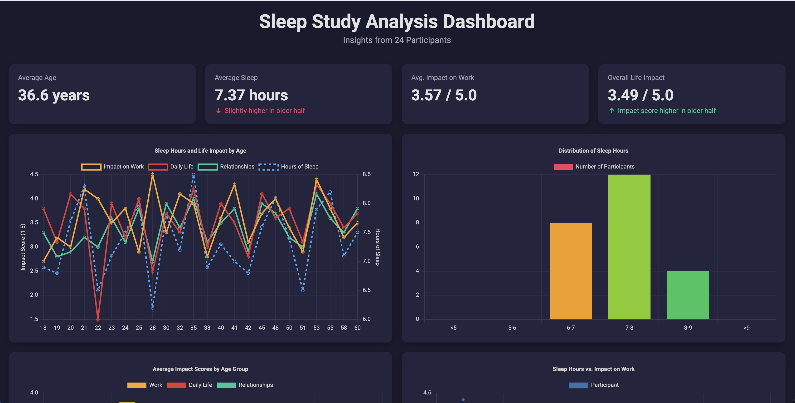
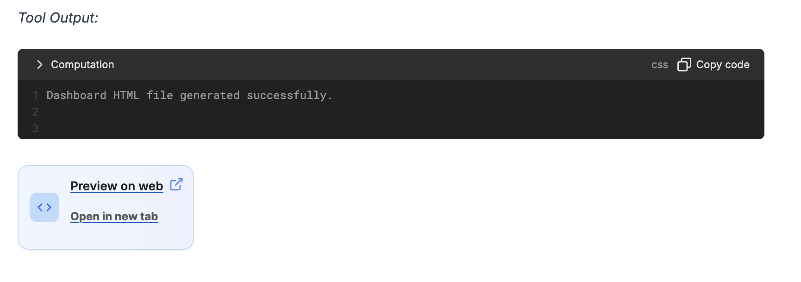

With Decide, you can go beyond static charts and reports by generating a comprehensive, self-contained dashboard in a single HTML file. This feature is designed to bring your data to life, allowing you and your stakeholders to explore insights in a professional, modern interface.

# What is a Decide Dashboard?
A Decide dashboard is a complete, one-page web application that visualizes your dataset. It combines key metrics, interactive charts, and detailed tables into a cohesive and easy-to-navigate layout. 

Because it's a single HTML file, it can be easily shared via email or any other platform and opened in any web browser without requiring an internet connection or special software.

# How to Create a Dashboard
Generating a dashboard is as simple as asking for one. Just upload your data and use a prompt like:

- "Create a dashboard from this data."
- "Build a sales performance dashboard using the attached file."
- "Generate an interactive dashboard to analyze customer demographics."

Decide will handle the entire process of analyzing the data, identifying key metrics, and building the interactive components. You can then preview it in a new tab.

# Key Features of a Decide Dashboard
    - Professional Design: Your dashboard is built with a sleek, dark-theme, and card-based layout that is fully responsive, ensuring a great experience on both desktop and mobile devices.
    - At-a-Glance KPIs: The top of the dashboard features interactive cards highlighting the most important Key Performance Indicators (KPIs). These cards use clear visual cues, like trend arrows, to show performance at a glance.
    - Interactive Visualizations: The dashboard includes a variety of charts (such as line graphs, bar charts, and pie charts) to display trends, comparisons, and distributions within your data. Hovering over the charts reveals detailed tooltips for deeper exploration.
    - Detailed Data Tables: For those who need a granular view, the dashboard includes a structured table to display the raw data in an organized format.
    - Automated Insights & Commentary: At the bottom, a dedicated section provides AI-generated commentary on the key trends and significant findings from the analysis, helping you understand the story behind the numbers.

This powerful feature turns your raw data into a polished, presentation-ready asset, perfect for sharing insights with your team, management, or clients.