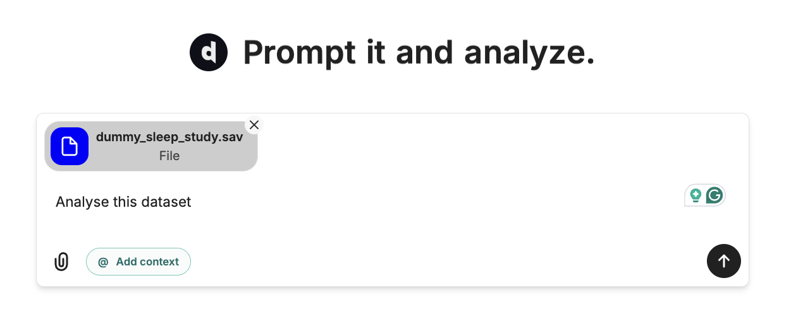
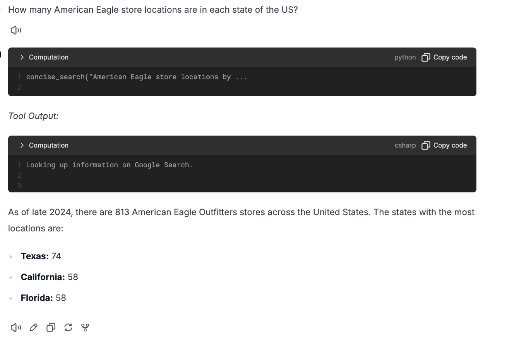
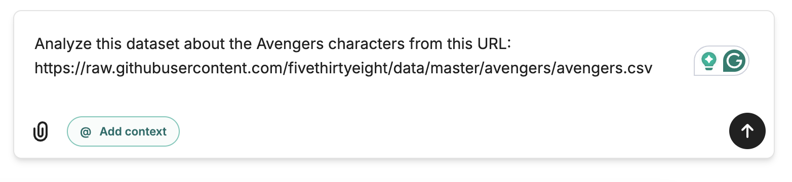
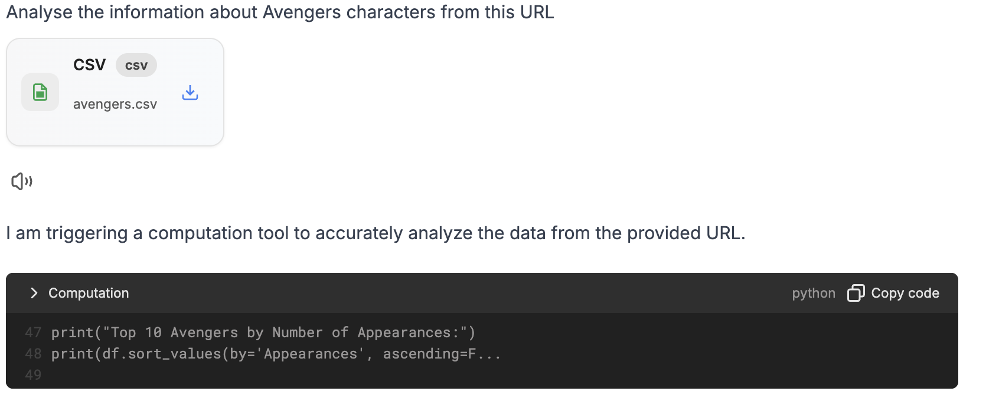
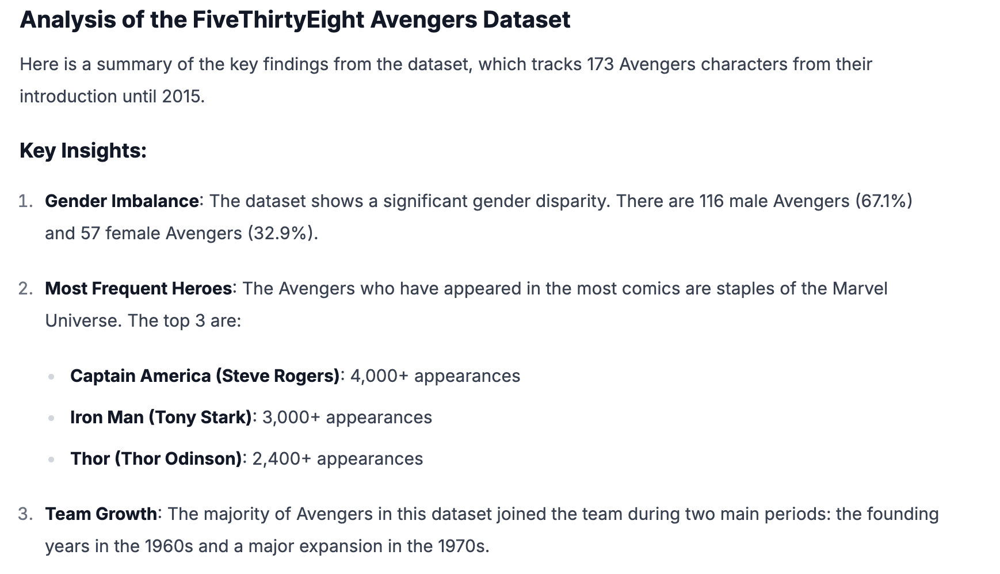

Upload spreadsheets, connect live sources, or drop in a link. Decide makes it effortless to start analyzing in seconds.

<AccordionGroup>
    <Accordion title="Upload CSV/Excel/PDF/SPSS files">
    Upload Excel files or PDFs to extract insights, run statistical analysis, or generate visualizations. Decide can instantly create dashboards and export your results in Excel, CSV, or PDF formats.
    
    </Accordion>

    <Accordion title="Analyze Live Online Data">
    Fetch the latest figures (such as employment or economic stats) instantly by asking Decide a question.
    
    </Accordion>

    <Accordion title="Drop in a website URL">
    Enter your prompt and the related URL
    

    Decide automatically downloads the data from the website and performs computations.
    
    
    </Accordion>

</AccordionGroup>