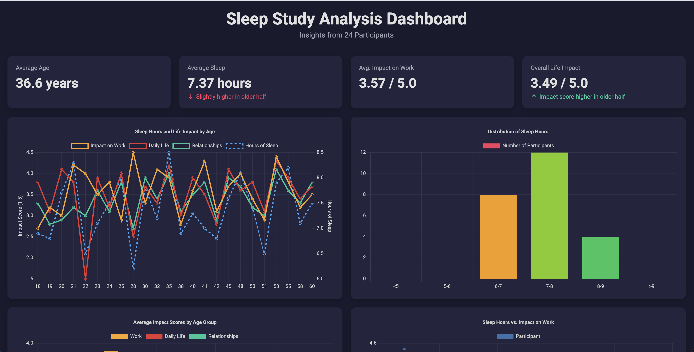

You have a few options for exporting your analysis from Decide, depending on how you plan to use the results.

1. Individual Visualizations
You can export each chart, including the pie chart, bar charts, and histogram, as a separate image file (e.g., .png or .jpeg). 

This is a great option if you need to use the visualizations in a presentation, report, or other external documents.

2. Cleaned Data File
Decide can export your cleaned dataset, to a .csv or .xlsx file. 

This is ideal if you want to perform further analysis using other tools like Excel, Tableau, or Power BI.

3. Comprehensive PDF Report
This option compiles the entire analysis, including the key insights, all the charts, and a summary of your findings, into a single, professionally formatted PDF document. 

It's the best choice for creating a complete, shareable report.

4. Shareable Dashboards
Decide can generate a fully interactive, self-contained HTML dashboard. The dashboard includes key performance indicators (KPIs), interactive charts, detailed tables, and insightful commentary, all presented in a professional, modern interface. 

It's the perfect way to present your findings to stakeholders, allowing them to explore the data dynamically in any web browser without needing any special software. To learn more, visit the [Dashboard](/dashboard) page.