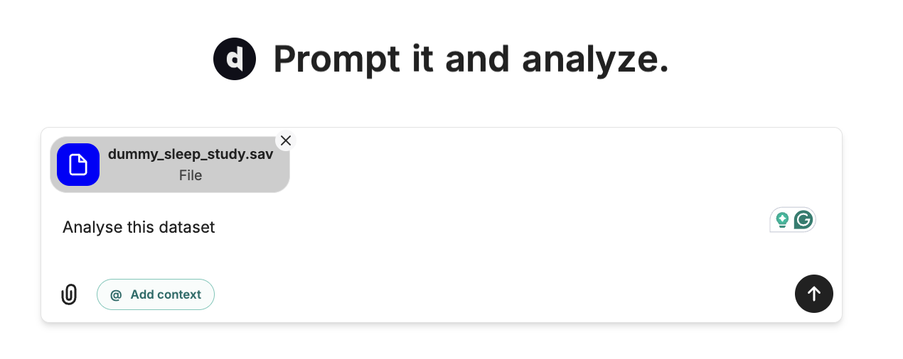

# Getting Started

<Steps>
  <Step title="Step 1: Choose How to Start">
    You can upload `.csv`, `.xls` (Excel), or `.sav` (SPSS) files directly to Decide.
    <Info>
      Before you begin, create an account.
    </Info>

    - Click the **Upload** button.
    - Select your data file.
    - Wait for the upload to complete.

    <Note>
    You can also skip uploading and just ask a question — Decide will fetch public data for you!
    </Note>
  </Step>
  <Step title="Step 2: Write your Prompt">
    

    Describe what you want to do. Be as specific or general as you like — Decide understands context and may ask clarifying questions if needed.
    Example requests:
      - "Show me a summary of this dataset."
      - "What are the top trends in my sales data?"
      - "Can you visualize the age distribution?"
      - "Analyze my dataset"
  </Step>
  <Step title="Step 3: Watch the Magic">
    Decide will analyze your request, understand your data, and execute the changes in real-time. You'll see exactly what's happening as it works.
    

    Decide can also generate visualisations of your analysis.
    

    Want to make custom visualisations? Check our [Visualizations](/visualizations) page.
  </Step>

</Steps>

---

## Example Use Cases

<CardGroup cols={2}>
  <Card title="Data Visualization" icon="chart-bar">
    Create charts and diagrams from your uploaded data.
  </Card>
  <Card title="Excel & CSV Analysis" icon="file-upload">
    Upload Excel or CSV files, get instant analysis, and export results.
  </Card>
  <Card title="Math & Statistics" icon="calculator">
    Get answers and explanations for math and statistics problems.
  </Card>
  <Card title="Web Data Extraction" icon="globe">
    Ask questions about public datasets — no upload needed!
  </Card>
</CardGroup>

---

<Note>
Need help? [Contact support](mailto:hi@trydecide.com) or check our [FAQ](/faq).
</Note>
