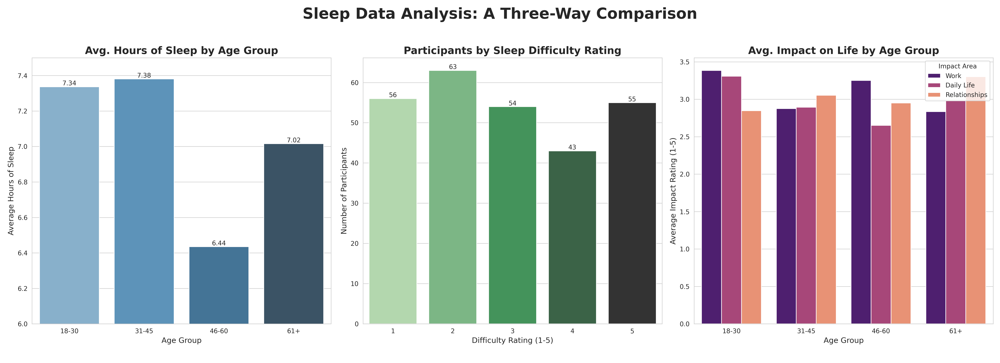
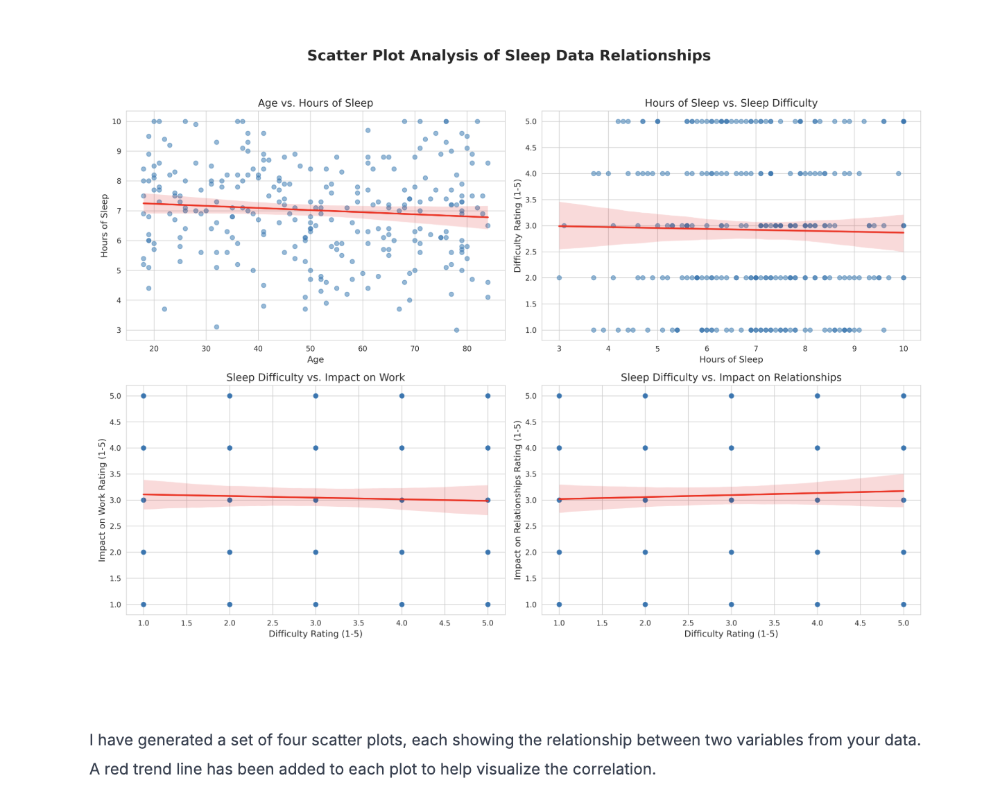

Decide can create a wide variety of visualizations to help you understand and present your data effectively. It primarily uses powerful Python libraries like Matplotlib and Seaborn to generate clear, professional, and insightful charts.

<Tabs>
  <Tab title="Comparison Charts">
    Comparison Charts are used to compare values across different categories.
    <Accordion title="Bar Charts (Vertical & Horizontal)">
      These are perfect for comparing quantities for distinct groups. For example, sales figures across different products.
      
      
      Decide generates the requested visualisations and also provides a summary of the insights for easy understanding.
      
    </Accordion>

    <Accordion title="Line Charts">
      Ideal for showing trends over a continuous period, like website traffic over a year. Decide can make both simple and complex line charts.
      
    </Accordion>
  </Tab>
  <Tab title="Distribution Charts">
    <Accordion title="Histograms">
      Show the frequency distribution of a single numerical variable, helping you see where most values are concentrated.
      
    </Accordion>
    <Accordion title="Box Plots (Box-and-Whisker Plots)">
      Provide a summary of a dataset's distribution, showing the median, quartiles, and outliers. Excellent for comparing distributions between several groups.
      
    </Accordion>
  </Tab>
  <Tab title="Relationship Charts">
    <Accordion title="Scatter Plots">
      Display the relationship between two numerical variables. They are the best way to visualize correlation and identify patterns or outliers.
      
    </Accordion>
    <Accordion title="Heatmaps">
      Use color to represent the magnitude of values in a matrix. They are especially useful for visualizing correlation matrices or complex datasets.
      
    </Accordion>
  </Tab>
  <Tab title="Composition Charts">
    <Accordion title="Pie Charts">
      A classic way to show the proportions of different categories that make up a total. Best used for a small number of categories.
      
    </Accordion>
    <Accordion title="Stacked Bar/Area Charts">
      Show how a total is divided into parts and how those parts change over time or across categories.
      
    </Accordion>
  </Tab>
</Tabs>

<Info>
  All generated visualizations are downloadable.
</Info>

## Customizing Visualizations

Decide makes it easy to turn your data into clear, interactive charts and dashboards. You can fully customize the **style, color, and chart type** of your visualizations to match your preferences or brand identity. From bar and line charts to pie and scatter plots, Decide gives you the flexibility to make your data not just informative, but also visually engaging.

You can select a theme for you chart using the `@ Add context` button

